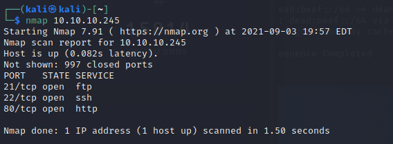
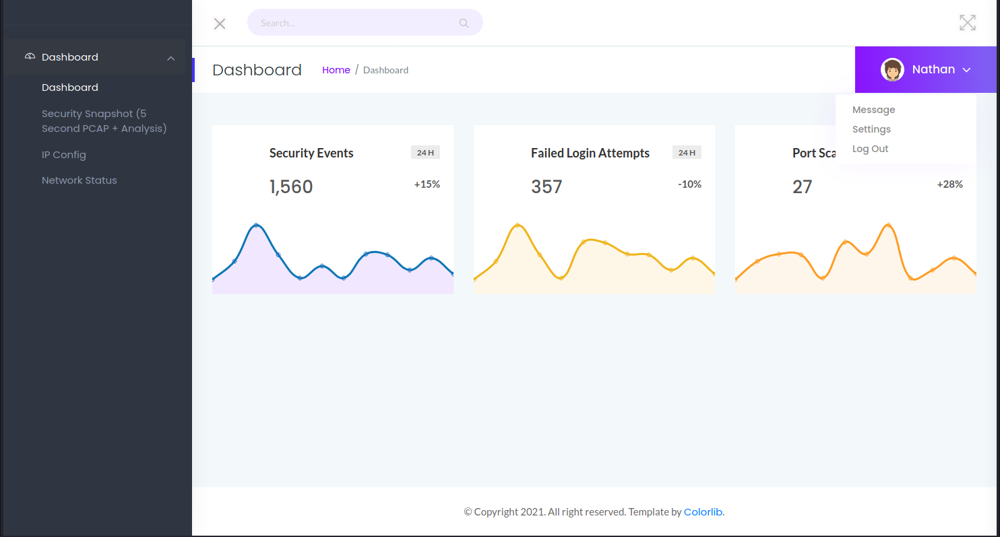
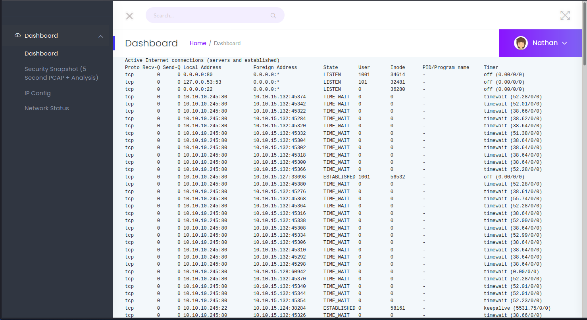
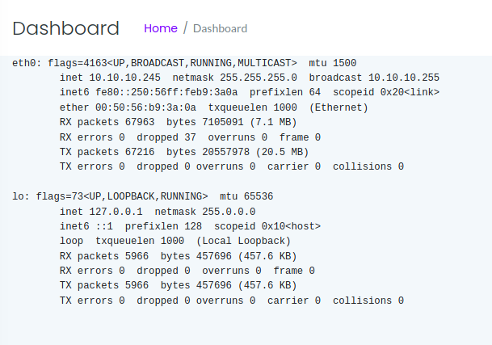
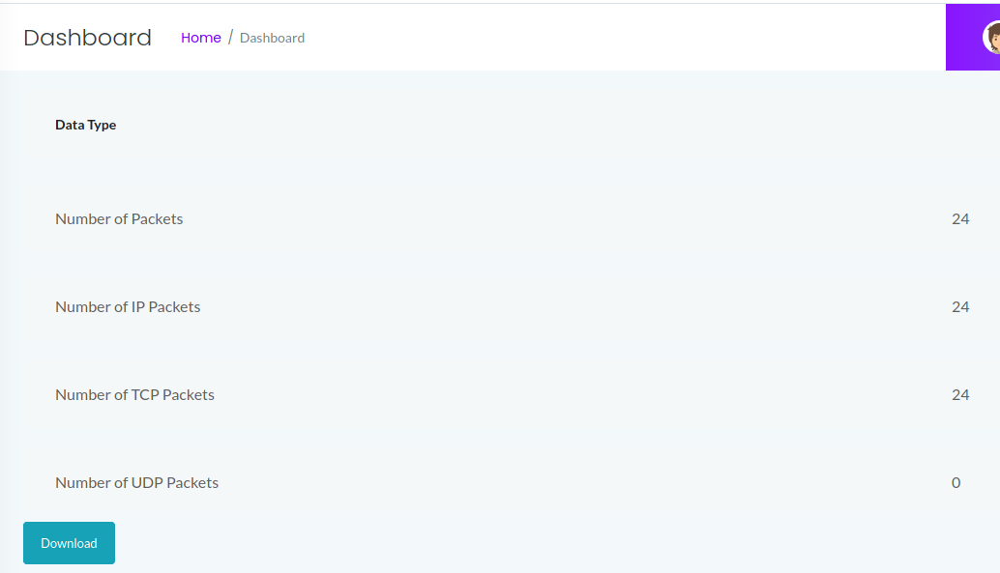
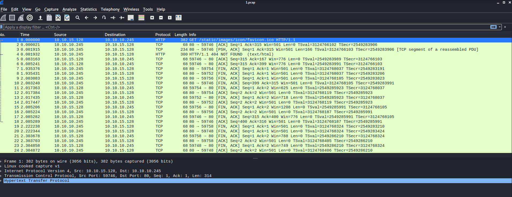
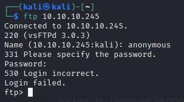
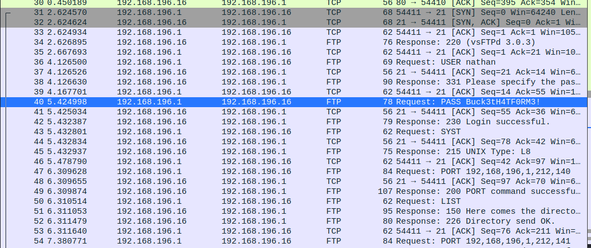
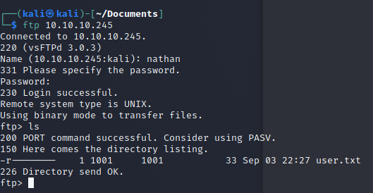
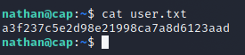

# Cap Box writeup

## Sean Kannanaikal Start Date 9/3/2021 - End Date 9/6/2021

Cap is a popular vulnerable machine from hackthebox with a rating of 4.3 stars.  It seems to be an excellent beginner penetration testing box to practice on.

***

## Information Gathering

I started off this pentest adventure by identifying all the open ports for Cap via the command
```
nmap 10.10.10.245
```



From here I see 3 ports open ftp, ssh, and http.  I tend to gravitate towards looking into the web interfaces first so I started to work on enumerating port 80 first.

### Port 80 enumeration



When we connect to the system over port 80 this is the website it is hosting.  I started off by noticing a user by the name of Nathan so I started making a list of users that we could utilize in the future.

From there I started playing with the options in the drop down under Nathan's name to no avail it seems those parts of the website haven't been coded yet. 

I then changed my direction towards the options on the dashboard.

Starting off with the Network Status page displayed down below.



It seems to be a large page displaying the results from the Netstat command interesting we will investigate that later in greater detail.

I next moved onto IP Config and just as I suspected it is displaying the results of ifconfig as shown in the capture below.



Unfortunately for us this doesn't give us any new information about the box that we dont know of already.

Then I looked into the final of the 3 pages within the dashboard the Security Snapshot which started giving me a new page incrementing the value found in the url by 1 however only the first one seems to have any information so I decided to download it.



Once I clicked the download page I was given a pcap file which I decided to open up in wireshark.  

The capture seems to be of 24 packet http interaction between my kali machine and the vulnerable machine.  



I wanted to move on temporarily and look into the other ports available to see if I can  pull anything else.

### Port 21 Enumeration

I wanted to start off with ftp I'm going to see how the service interacts when we attempt to connect to it.



So I initially attempted to see if it allows anonymous ftp login access however it doesn't so I moved on to attempting to bruteforce the credentials with the user **Nathan**.  Using the command down below

```
hydra -L names.txt -P /usr/share/wordlists/fasttrack.txt -t 10 10.10.10.245 ftp
```

This did not give me any successful results so I moved on to attempting to enumerate some more.

```
nmap -p 21 -A -sV -sC 10.10.10.245
```

this command was in hopes of identifying any new service information to no avail once again.

So at this point I was pretty stumped and decided to take a break.  From past experience FTP and SSH enumeration usually provide no effective results unless I bruteforce the systems which would take countless amount of hours so I decided to resort to that as a last ditch effort.  As a result I returned to investigating port 80.

### Port 80 the Return

So when I went back to port 80 I decided to take a long look at the netstat and ipconfig pages knowing that these results are based on real linux commands I decided to try and type in commands within the url which didn't work.  I also tried fiddling around with the netstat page by continously refresshing it and noting down specific connections however nothing was effective and I decided to take a break.

During this break I began to reconsider the machine if there was any aspect of it that was unique or unusual, thats when I figured it out the pcap file system.  Not only that but there were directories starting from 1 all the way to n where n is the number of times we visit the page.  However there was always one little problem with  each of the pcap files that I brushed aside earlier: the lack of the 3 way tcp handshake.  I then though of maybe that there was a 0th pcap and voila there was indeed a 0th pcap file I immediately downloaded and would you look at that FTP credentials for the user nathan.




### FTP enumeration

From here I returned to the ftp client

```
ftp 10.10.10.245
```

connected to it with the credentials **nathan** and **Buck3tH4TF0RM3!**

and boom a directory with a flag in a text document titled user.txt.



**FLAG: a3f237c5e2d98e21998ca7a8d6123aad**

### SSH Login

It was just a simple guess but many users tend to repeat credentials so I logged into ssh using the same credentials with the command

```
ssh nathan@10.10.10.245
```

and I was in nathan's home directory where once again I have access to the user flag.




## Privliege Escalation

Once I got into the system I realized I was not really that good with actually privliege escalating so I ended up spending an entire weekend learning about many techniques from looking at kernel exploits, ssh key generating, SUID, SGID, writing to directories and many more.  Hilariously I assumed the privliege esclation aspect would require a complicated string of commands in order to achieve the desired output however python3 was available.  Not only that but I utilized 2 aspects of privliege escalation I learned file capabilities and gtfobins.

I utilized the command 

```
getcap -r / 2>/dev/null
```

With this command I was able to see file capabiliteies for binaries one of which was python3 which had the cap_setuid capability set.  With that I ended up going to gtfobins and found an exploit command which could allow me to break out of shells.

```
/usr/bin/python3.8 -c 'import os; os.setuid(0); os.system("/bin/sh")'
```

I was then successfully able to spawn a root shell then simply navigated myself to the root directory and obtained the flag.

**cb83b576c64b8b8e3f5b8939460f1496**