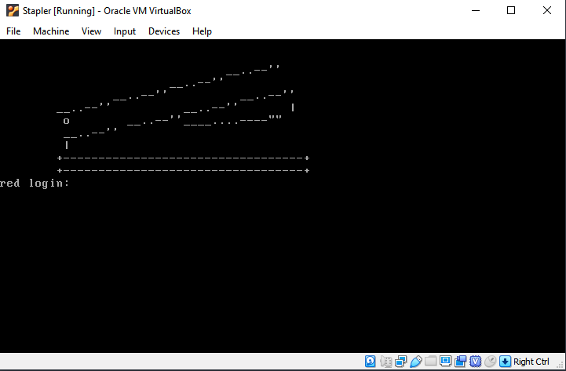
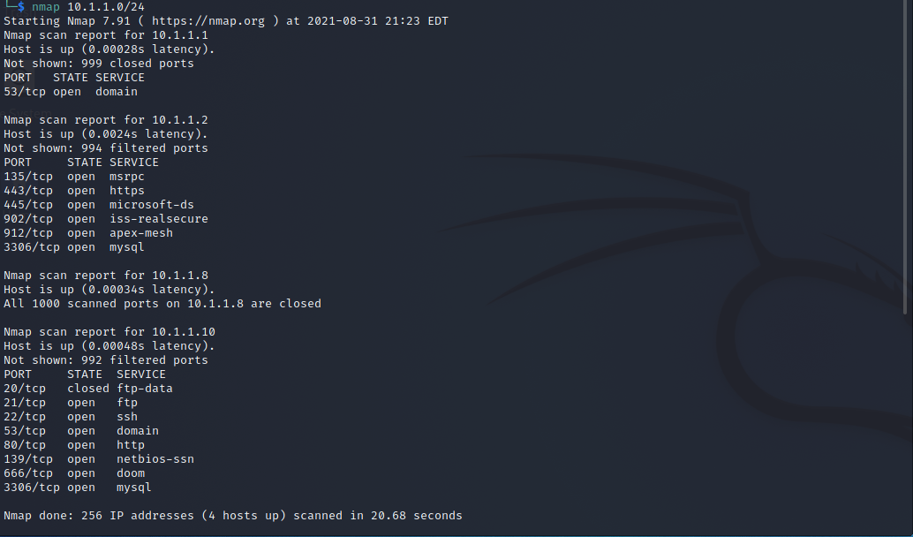
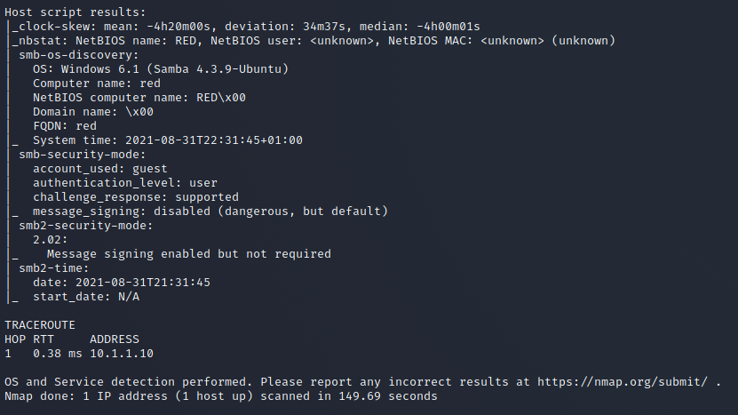
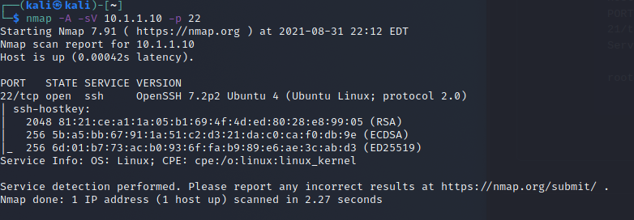

# Vulnerable Machine Stapler Writeup
## Sean Kannanaikal Start Date: 8/3/2021



[Stapler](https://www.vulnhub.com/entry/stapler-1,150/) is a Vulnerable VM found at Vulnhub.com.  The creator claims it has "2 ways to get a limited shell and at least 3 ways to get root access".  My goal in this VM is to get a complete boot2root with this VM.

***

# Information Gathering
I started of by trying to find the IP address of the VM.  It is currently running within a NAT Network between my VMs.  In order to find out the IP of the machine I started a scan on the entire subnet.

```
nmap 10.1.1.0/24
```

This command allowed me to scan the entire network and it gave me the results shown below.



There looking at the scan results I was able to determine the vulnerable VM was found at the IP **10.1.1.10**.

I Then decided to do a more focused scan in order to understand the OS, and specific versions of the ports.

```
sudo nmap -A -sV 10.1.1.10 -p 0-65535
```

With this extend nmap scan I will be scanning all potential ports that the system could be using alongside doing a service detection scan. The results I obtained are depicted in the scan down below.




With all the data that I just btained I needed to begin to research and cross reference the results I obtained to make my way through this treasure chest of information and get the lay of the land. However, I wanted to try gathering information on each of the ports individually by playing with the software.

## FTP investigation
In order to get further information I began attempting to interact with each of the open ports starting off with FTP.

I started off by attempting to connect to the ftp via the command
```
ftp 10.1.1.10
```

I was successfully able to connect and get prompted with a login screen but also was given a neat little message when I connected.


"Harry, make sure to update the banner when you get a chance to show who has access here"

Ok so I'm beginning to get an office feel with the stapler and now someone is talking to Harry and explaining to him some tasks he has to get finished.  Not only that but maybe its safe to assume that Harry has access to the FTP server if he can show who has access by updating the banner displayed.  Not only that but I tried to see if I could login via the popular anonymous login account.  

Simply put if one types in the username anonymous followed by a random password they can log into the ftp server as long as anonymous login is setup.

Wonderful it seems this FTP server has anonymous login setup not a good sign as it allows attackers such as myself to access important resources.  Not only that but from the previous message addressed to Harry I was able to paint a small picture of the infrastructure within my head.  Interested by this I began to create a list of interesting findings with both the name Harry and anonymous noted.

Moving on now that I am in the ftp server I began to search a round for information.

```
ls
```


Intersting a file titled note I decided to transfer that file over to my local machine for future inspection.  I then tested to see if I could upload any files from my system  however I get a 550 Permission denied error. Oh well but I do have a note which could be intersting. I disconnected from the ftp server and went to see the note.


Interesting two new users Elly and John.  I immediately added these names to the name file and began to attempt to bruteforce login with the username **John**.

Using Hydra I attempted to find John's credentials to get access to this payload that Elly developed.

```
Hydra -l John -P /usr/share/wordlists/fasttrack.txt 10.1.1.10 -t 10 ftp
```

No results hmmm... Ok I tried one more time with another wordlist.

```
Hydra -l John -P /usr/share/wordlists/rockyou.txt 10.1.1.10 -t 10 ftp
```
Rockyou.txt is famous for being quite a large file so instead of waiting for the entire bruteforce to finish to finish I began looking into the ftp server from another angle.

Once again to get a more focused view of ftp I did a simple nmap scan

```
sudo nmap -A -sV 10.1.1.10 -p 21
```

Ok so just as I tested anonymous login is allowed.  I was also able to find the version of the software is vsFTPd 3.0.3 labeled to be secure fast, stable.  I wonder?  I began to search through google for vulnerabilities associated with the system.  Unfortunately it may seem that vsFTPd 3.0.3 may seem quite secure aside from a Denial of Service attack which I may code up during a later time, but for now I will move onto another port.  Lets do SSH as its the next numerically speaking.

## SSH Investigation

```
sudo nmap -A -sV 10.1.1.10 -p 22
```


Unfortunately I was provied by no glaring issues so I tried connecting to the ssh server.


Interesting another name Barry which I immediately added to the names listing.